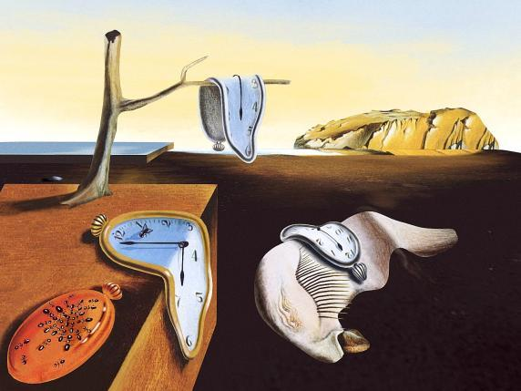
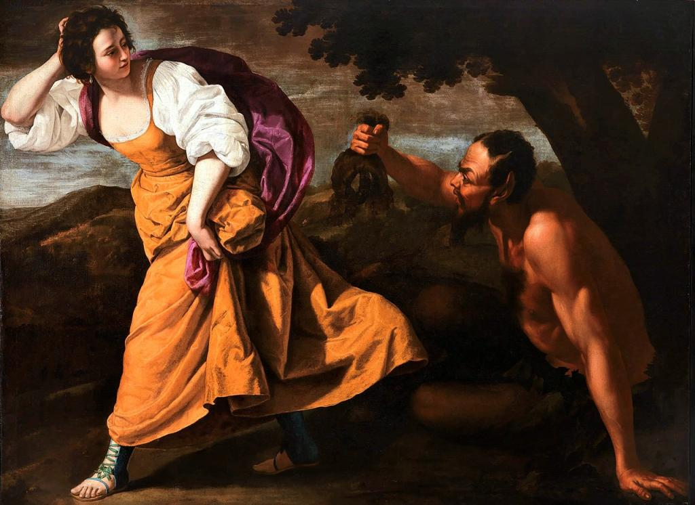
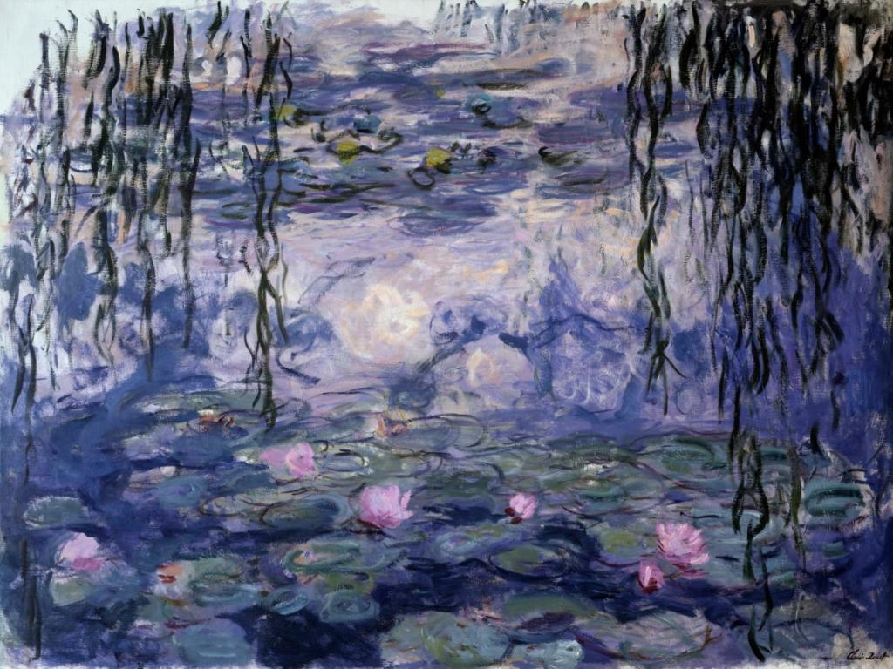
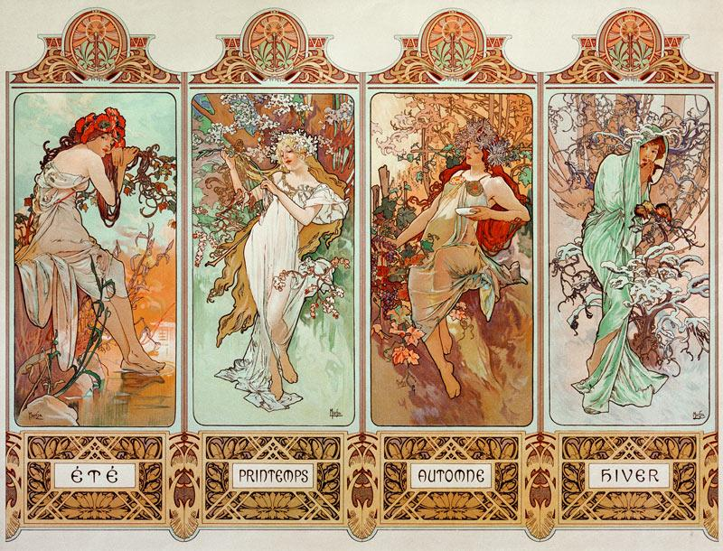
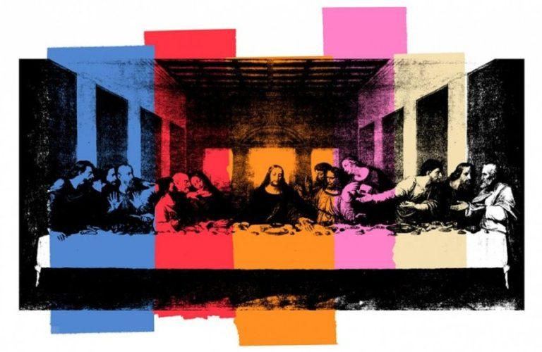

## Introduction

This project had the purpose of creating an augmented museum with Unity.  
My concept was to design a small building, representing the museum.  
The scene begins with a dialogue telling the user to look at the floor to start the experience.  
Once ground detection is complete, the interior of the museum appears directly onto the detected surface, and an empty picture frame is displayed in front of the user.  
A dialogue tells to scan a real-world painting, which triggers the appearance of its virtual representation inside the frame, a virtual muse and a dialogue with the related information.

## Libraries, SDKs and sources

- **Vuforia Engine**: for `ImageTarget` recognition and ground detection via `GroundPlaneStage`, `PlaneFinder` and `ARCamera`.
- **ARCore**: to compile and build the Android APK.
- **TextMeshPro (UI)**: to render dialogues on a UI canvas.
- [**ElevenLabs**](https://elevenlabs.io/text-to-speech): online text-to-speech platform used to generate the voices of the muses.
- **Unity Asset Store**: for the assets regarding the museum
- [**SketchFab**](https://sketchfab.com/feed): for the assets regarding the muses

## Implementation

<table>
  <tr>
    <td></td>
    <td></td>
    <td></td>
  </tr>
  <tr>
    <td></td>
    <td></td>
    <td></td>
  </tr>
</table>

I chose 5 horizontal paintings, to be able to efficiently take advantage of the orientation of the picture frame:

- *The Persistence of Memory* by Salvador Dalì
- *Corisca and the Satyr* by Artemisia Gentileschi
- *Water Lilies* by Claude Monet
- *The Four Seasons* by Alphonse Mucha
- *The Last Supper* by Andy Warhol

Then, I implemented the following scripts:

- `PlaneFinder.cs`: handles ground plane detection and the consequent placement of the museum.
- `AugmentationManager.cs`: manages the activation of the 3D virtual representations of the `ImageTargets`, to ensure that only one is active at a time.
- `ImageTarget.cs`: detects and processes the scanned `ImageTarget` and communicates with `AugmentationManager` and `Dialogue`.
- `Dialogue.cs`: controls the narration, so that it triggers a dialogue, audio and muse corresponding to the detected `ImageTarget`.
- `Muse.cs`: manages the activation of the muses, to ensure that only one is active at a time.

## Stylistic choices

I downloaded the following assets:

- [Furniture and architecture](https://assetstore.unity.com/packages/3d/environments/urban/modular-european-house-294289)
- Muses:
  - Thalia  
    "Statue of the Muse Thalia" (https://skfb.ly/oNJFE) by Samuel F. Johanns (Oneironauticus) is licensed under Creative Commons Attribution ([http://creativecommons.org/licenses/by/4.0/](http://creativecommons.org/licenses/by/4.0/)).
  - Terpsichore  
    "Muse" (https://skfb.ly/onJYV) by noe-3d.at is licensed under Creative Commons Attribution ([http://creativecommons.org/licenses/by/4.0/](http://creativecommons.org/licenses/by/4.0/)).
  - Euterpe  
    "Muse" (https://skfb.ly/o7VtM) by noe-3d.at is licensed under Creative Commons Attribution-NonCommercial ([http://creativecommons.org/licenses/by-nc/4.0/](http://creativecommons.org/licenses/by-nc/4.0/)).
  - Melpomene  
    "Muse" (https://skfb.ly/onXJG) by noe-3d.at is licensed under Creative Commons Attribution-NonCommercial ([http://creativecommons.org/licenses/by-nc/4.0/](http://creativecommons.org/licenses/by-nc/4.0/)).
  - Urania  
    "Muse" (https://skfb.ly/o6w7D) by noe-3d.at is licensed under Creative Commons Attribution-NonCommercial ([http://creativecommons.org/licenses/by-nc/4.0/](http://creativecommons.org/licenses/by-nc/4.0/)).

  Some of them had to be downloaded into `GLB` format and then converted into `FBX`.

- A wooden frame  
  "Simple Wooden Picture Frame" (https://skfb.ly/KWsw) by Nicholas Record is licensed under Creative Commons Attribution ([http://creativecommons.org/licenses/by/4.0/](http://creativecommons.org/licenses/by/4.0/)).

I modified the rendering of certain architectural elements to make both sides of the surfaces visible.  
Additionally, I customized the dialogue font to [Texturina](https://fonts.google.com/specimen/Texturina) to maintain stylistic cohesion.
